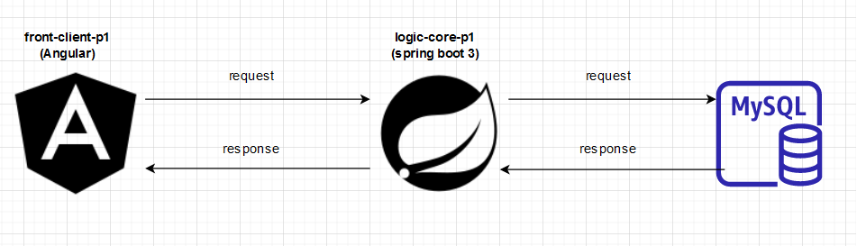

# logic-core-p1 microservice

 

1. What does this microservice do:
    - the microservice receives requests from [front-client-p1](https://github.com/SuperGini/front-client-p1) which is the front-end microservice end redirects the request to a mySQL database.
    - the microservice can save and retrieve users in database and can create/delete folders and pictures/files, that can later be retrieved by the user.
    - the entire app wants to be a file manager app.

2. Technologies use to create this project:

   - spring boot 3
   - spring framework 6
      - spring-web
      - spring-validation
      - spring dataJPA/Hibernate
      - lombok
      - mysql connector- j
   - other dependencies:
     - [testcontainers](https://github.com/testcontainers/testcontainers-java)
     - [hypersistence-utils-hibernate-60](https://github.com/vladmihalcea/hypersistence-utils)
     - [datasource-proxy](https://github.com/jdbc-observations/datasource-proxy) - for logging SQL statements
   - java 17
   - mySQL/SQL
   - gradle

Architecture:
 

